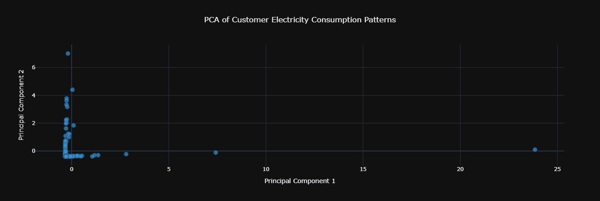
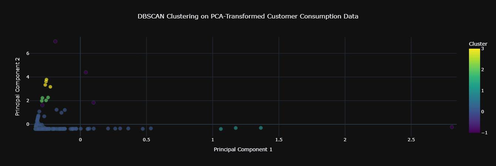
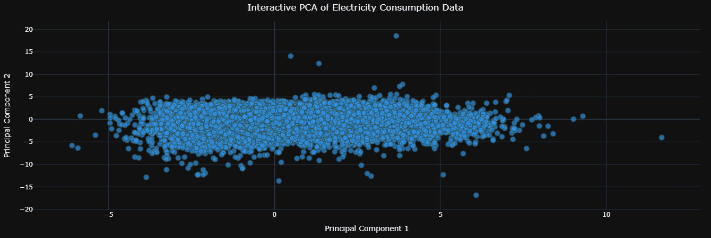
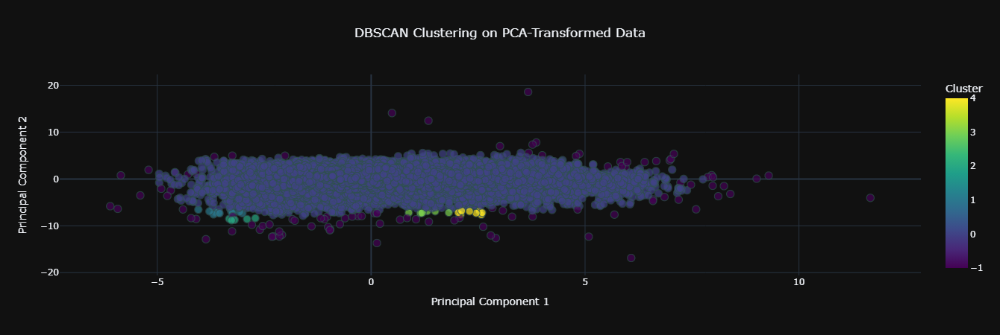
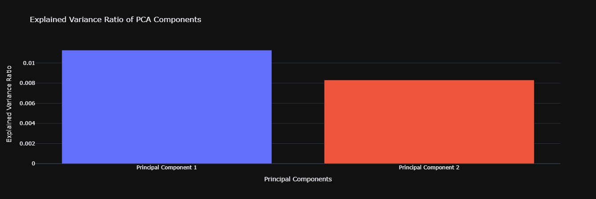

# 📊 PCA + DBSCAN Clustering Model for Customer Consumption Data

This project implements an **unsupervised machine learning pipeline** using **PCA (Principal Component Analysis)** and **DBSCAN (Density-Based Spatial Clustering of Applications with Noise)** to analyze and classify customer electricity consumption patterns.

---

## 🚀 **Project Structure**

```
.
├── src
│   ├── pca_dbscan_model.py       # Model training script
│   └── pca_dbscan_inference.py   # Inference script for predictions
├── pcs_dbscan_experiment.ipynb   # Jupyter notebook for PCA + DBSCAN experiments
├── images/                       # Folder containing plots from experiments
│   ├── customer_pca_dbscan.png
│   ├── customer_pca.png
│   ├── pca1.png
│   ├── time_pca_dbscan.png
│   └── vairance.png
├── cleaned_electricity_data.csv  # Preprocessed electricity consumption data
├── new_customer_data.csv         # New data for cluster predictions
└── README.md                     # Project documentation
```

- **`src/` Folder:** Contains the main model and inference scripts.
- **`pcs_dbscan_experiment.ipynb`:** Interactive notebook for experimentation with PCA and DBSCAN.
- **`images/` Folder:** Stores visualization outputs from PCA and DBSCAN experiments.
- **Data Files:** Include cleaned historical data and new data for predictions.

---

## 📈 **Experiment Results: PCA + DBSCAN Visualizations**

### 1️⃣ PCA Visualization (Customer Data)

*Figure 1: PCA Visualization showing customer consumption patterns in reduced dimensions.*

### 2️⃣ PCA + DBSCAN Clustering (Customer Data)

*Figure 2: DBSCAN clustering results applied on PCA-transformed customer data.*

### 3️⃣ PCA Plot

*Figure 3: Principal Component Analysis capturing key variance in the data.*

### 4️⃣ Time-based PCA + DBSCAN

*Figure 4: DBSCAN clustering on time-segmented PCA data, highlighting temporal patterns.*

### 5️⃣ Variance Explained by Principal Components

*Figure 5: Variance explained by each principal component, indicating the contribution to total data variance.*

---

## ⚡ **Getting Started**

### 1️⃣ **Clone the Repository:**
```bash
git clone https://github.com/your-repo.git
cd your-repo
```

### 2️⃣ **Install Dependencies:**
```bash
pip install -r requirements.txt
```
*(Ensure Python 3.8+ and libraries like `pandas`, `scikit-learn`, `joblib` are installed)*

### 3️⃣ **Prepare Data:**
- Place your cleaned dataset as `cleaned_electricity_data.csv`.
- Ensure new data for predictions is in `new_customer_data.csv` format.

---

## 🔗 **Dataset Source**

The dataset used in this project comes from the **UCI Machine Learning Repository**:

[Electricity Load Diagrams 2011-2014 Dataset](https://archive.ics.uci.edu/dataset/321/electricityloaddiagrams20112014)

- **Description:** Contains electricity consumption data from 2011 to 2014.
- **Usage:** The data is cleaned and preprocessed for clustering analysis.

---

## 🧠 **What the Code Does**

### **1️⃣ pca_dbscan_model.py**
This script is responsible for **training the PCA + DBSCAN model**:
- **Data Loading:** Reads the cleaned electricity consumption data.
- **Preprocessing:** Pivots the data to organize it by `Customer_ID` and `Timestamp`, fills missing values, and scales the data.
- **Pipeline Creation:** Constructs a pipeline that includes:
  - `StandardScaler` for data normalization.
  - `PCA` for dimensionality reduction.
  - `DBSCAN` for clustering and anomaly detection.
- **Model Training:** Fits the data into the pipeline and assigns cluster labels.
- **Model Saving:** Saves the trained model as `pca_dbscan_model.pkl` for future use.

### **2️⃣ pca_dbscan_inference.py**
This script handles **making predictions on new data**:
- **Model Loading:** Loads the pre-trained `pca_dbscan_model.pkl`.
- **New Data Processing:** Prepares new customer consumption data similarly to the training data.
- **Cluster Prediction:** Uses the model to predict clusters (or detect anomalies).
- **Result Saving:** Outputs the predicted clusters into `predicted_clusters.csv`.

### **3️⃣ pcs_dbscan_experiment.ipynb**
This Jupyter Notebook is for **interactive experimentation**:
- **Exploratory Data Analysis:** Allows users to visualize consumption patterns.
- **PCA Analysis:** Experiment with different numbers of principal components.
- **DBSCAN Tuning:** Adjust DBSCAN parameters (`eps`, `min_samples`) to see how clustering changes.
- **Visualizations:** Generate dynamic plots to understand clustering behavior.

---

## 🚀 **Future Improvements**

- API deployment for real-time predictions.
- Advanced visualization dashboards.
- Integration with time-series anomaly detection models.

---

## 🙌 **Contributing**

Feel free to fork, improve, and submit pull requests. For issues, open a ticket in the repository.

---

## 📄 **License**

This project is licensed under the MIT License.
